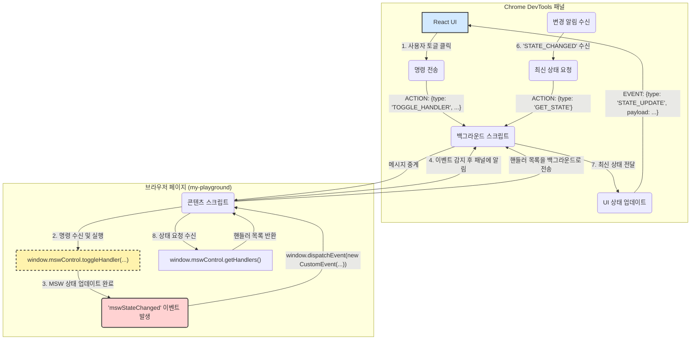

# MSW DevTools Controller

`@dy/my-playground` 애플리케이션의 MSW(Mock Service Worker) 핸들러를 동적으로 제어하기 위한 Chrome 개발자 도구 확장 프로그램입니다.

이 도구를 사용하면 브라우저를 새로고침하지 않고도 실시간으로 API 모킹을 켜고 끌 수 있어, 프론트엔드 개발 및 테스트 생산성을 크게 향상시킬 수 있습니다.

## 주요 기능

- **커스텀 패널**: 개발자 도구에 'MSW Controls'라는 전용 탭을 추가합니다.
- **그룹화된 UI**: Swagger UI처럼 핸들러를 API 그룹별로 나누어 보여주며, 각 그룹은 접고 펼 수 있습니다.
- **개별 핸들러 제어**: 각 핸들러 옆의 토글 스위치를 통해 개별적으로 모킹을 활성화/비활성화할 수 있습니다.
- **실시간 코드 동기화**: 개발자가 로컬에서 핸들러 파일을 수정하고 저장(HMR)하면, 패널 UI에 변경사항이 자동으로 반영됩니다.

## 핵심 아키텍처 원칙

이 확장 프로그램은 버그 발생을 원천적으로 방지하고 예측 가능하게 동작하도록 두 가지 핵심 원칙을 기반으로 설계되었습니다.

### 1. 단일 진실 공급원 (Single Source of Truth, SSoT)

시스템의 '진실된' 상태는 오직 한 곳, 즉 **검사 대상 페이지에서 실행 중인 `window.mswControl` 객체**에만 존재합니다.

개발자 도구 패널은 이 '진실'을 가져와 보여주는 '뷰(View)'일 뿐이며, 절대 스스로 상태를 추측하거나 낙관적으로 업데이트하지 않습니다.

### 2. 견고한 단방향 데이터 흐름

SSoT 원칙을 지키기 위해, 모든 상태 변경은 아래와 같은 엄격한 단방향 데이터 흐름을 따릅니다.



이 흐름은 UI가 실제 상태와 달라지는 버그를 원천적으로 방지합니다.

## 프로젝트 구조

확장 프로그램은 여러 독립적인 스크립트가 협력하여 동작합니다.

- **`panel`** (`panel.html`, `src/panel/`): 사용자가 직접 상호작용하는 React 기반의 UI입니다.
- **`background`** (`src/background.ts`): 패널과 콘텐츠 스크립트 사이의 메시지를 중계하는 중앙 '교환원' 역할을 하는 서비스 워커입니다.
- **`content_script`** (`src/content-script.ts`): 검사 대상 웹 페이지에 직접 삽입되어, 페이지의 `window.mswControl` 객체와 통신하는 '다리' 역할을 합니다.
- **`devtools_page`** (`devtools.html`): 개발자 도구가 열릴 때 'MSW Controls' 패널 탭을 생성하는, 보이지 않는 초기 설정 페이지입니다.

## 설치 및 실행 방법

1.  **의존성 설치**
    프로젝트의 루트 디렉토리에서 아래 명령어를 실행합니다.

    ```bash
    npm install
    ```

2.  **확장 프로그램 빌드**
    프로젝트 루트 디렉토리에서 빌드 명령어를 실행합니다. `dist` 폴더에 빌드 결과물이 생성됩니다.

    ```bash
    npm build
    ```

3.  **Chrome에 확장 프로그램 로드** ( 추후 앱 출시 )
    1.  Chrome 브라우저에서 `chrome://extensions` 주소로 이동합니다.
    2.  오른쪽 상단의 **'개발자 모드'** 스위치를 켭니다.
    3.  왼쪽 상단의 **'압축 해제된 확장 프로그램을 로드합니다'** 버튼을 클릭합니다.
    4.  파일 탐색기가 열리면, 위에서 생성된 `packages/msw-devtools/dist` 폴더를 선택합니다.
    5.  "MSW DevTools Controller"가 확장 프로그램 목록에 추가되면 성공입니다.

## 웹 앱 연동 설정

이 확장 프로그램이 동작하려면, `my-playground` 앱에 아래 두 가지 기능이 구현되어 있어야 합니다.

1.  `window.mswControl` 객체에 핸들러 목록을 반환하는 `getHandlers()` 메소드 노출
2.  핸들러 상태가 변경될 때마다(예: `reinitialize()` 호출 시) `mswStateChanged` 커스텀 이벤트를 `window` 객체에서 발생시키는 로직

## 사용법

1.  `my-playground` 개발 서버를 실행합니다.
2.  `my-playground` 페이지에서 개발자 도구(F12)를 엽니다.
3.  상단 탭 목록에서 **"MSW Controls"** 탭을 찾아 클릭합니다.
4.  패널이 자동으로 현재 페이지의 MSW 핸들러 목록을 불러옵니다.
5.  토글 스위치를 클릭하여 원하는 핸들러를 켜거나 끌 수 있습니다. 변경 사항은 즉시 적용됩니다.
